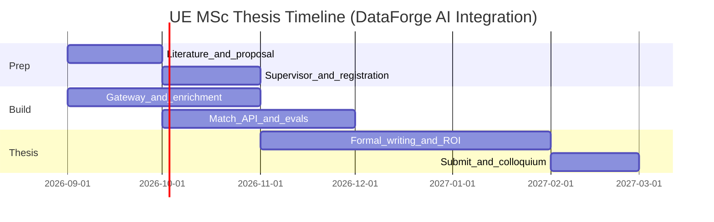

# Integrating Multi-Provider Generative AI into an Existing Production Data Pipeline: Architecture, Model Selection, Evaluation, and Business Value — A Case Study on European Job Intelligence (DataForge)

**Master's Thesis Proposal**

| | |
|---|---|
| **Program** | MSc Data Science |
| **Institution** | University of Europe for Applied Sciences, Potsdam |
| **Submitted by** | Ritesh Rakesh Jadhav |
| **Proposed Erstbetreuung** | Prof. Dr. Iftikhar Ahmed |
| **Proposed Zweitbetreuung** | Prasanna Easwarananthan or Thiyaghamani Jeyaraman |
| **Date** | September 2026 |
| **Reference system** | [DataForge](https://ritesh8303.github.io/dataforge/) (live AWS lakehouse) |

---

## Abstract

European labour-market data is fragmented across government portals, aggregators, and company applicant-tracking systems. DataForge already addresses this fragmentation with a production serverless medallion lakehouse on AWS: multi-source ETL, SCD Type 2 history, Gold analytics, public APIs, and a GitHub Pages product surface. Industry demand, however, has moved beyond raw aggregation toward **AI-augmented intelligence**—semantic matching, structured enrichment, and measurable cost control—while most academic GenAI work still studies chatbots or greenfield RAG demos rather than integration into an existing production pipeline.

This thesis proposes to extend DataForge with a multi-provider generative AI layer (model gateway, batch enrichment, embedding-based Match API, and evaluation harness) **without rebuilding the lakehouse**. The study empirically compares providers and model classes on quality, cost, latency, and EU data residency; tests whether dense retrieval outperforms the current rule-based Career Matching Wizard; and analyses unit economics of AI features versus pure open-data aggregation.

The contribution is a reproducible reference architecture and evaluation protocol for integrating GenAI into medallion pipelines under realistic free-tier and compliance constraints—bridging data engineering, LLMOps, and applied business analysis for the UE MSc Data Science profile.

---

## 1. Introduction and Background

Labour-market intelligence is a core input for universities, career services, HR tech, and job seekers. In Europe, vacancy data is spread across the German Federal Employment Agency (BA Jobsuche), EURES, niche aggregators such as Arbeitnow and Berlin Startup Jobs, and hundreds of direct ATS feeds (Greenhouse, Lever, Workday, Personio, and others). Building a trustworthy analytical product from these sources requires disciplined data engineering: ingest validation, historical versioning, quality gates, and serving layers that remain reproducible under cost constraints.

DataForge was developed as a capstone-style production system that solves this engineering problem. It runs a daily EventBridge-scheduled pipeline in `eu-central-1`: Bronze Parquet snapshots, Silver SCD Type 2 history, Gold analytics CSVs and metrics, API Gateway endpoints for jobs and metrics, and a public dashboard. Contracts, a data dictionary, CI quality gates, and dbt marts on Gold aggregates are already in place.

What DataForge still lacks—and what employers increasingly require—is **production-shaped generative AI**: structured LLM enrichment that does not corrupt SCD keys, semantic job–resume matching with measurable ranking quality, multi-provider routing to avoid lock-in, and honest cost/latency logging. The current Career Matching Wizard uses rule-based keyword scoring; skill extraction in Gold relies on regex. Those baselines are intentional and useful for science: they make A/B evaluation possible.

This proposal therefore frames the thesis as an **integration and evaluation study**, not a greenfield chatbot. The research asks how GenAI can be added to an existing medallion lakehouse, which models win under multi-objective constraints, whether retrieval beats heuristics on ranked relevance, and whether AI product features improve unit economics versus raw data licensing.

The remainder of this document states the problem, objectives and research questions, related work gap, theoretical framing, methodology, ethics, timeline, and expected contributions.

---

## 2. Problem Statement

Companies and platform teams rarely start from a blank notebook. They must attach LLMs to pipelines that already enforce lineage, schemas, budgets, and compliance. Academic and tutorial literature under-emphasizes this setting: many projects report model accuracy without production constraints, or deploy RAG systems without a durable data platform underneath.

In the DataForge case, three concrete problems remain open:

| Challenge | Description |
|---|---|
| **Integration without breakage** | Adding LLMs must not mutate `job_id` / SCD keys, must keep classic Gold KPIs reproducible, and must fit serverless free-tier envelopes. |
| **Model and provider selection** | OpenAI, Anthropic, AWS Bedrock (EU), and local/open models differ on quality, €/1k tokens, latency, failure modes, and residency—selection needs empirical multi-objective evidence, not vendor marketing. |
| **Weak matching baseline** | Rule-based resume–job scoring is transparent but limited; whether embeddings + optional rerank deliver better ranked relevance is an empirical question. |
| **Monetization uncertainty** | Open vacancy derivatives have weak moats; it is unclear under which packaging (Match API, enrichment, reports) AI features create positive unit economics. |
| **Trust and compliance** | Public vacancy text still requires GDPR-aware handling, audit logs, kill switches, and EU AI Act–aware documentation for automated decision-support features. |
| **Evaluation honesty** | Without held-out labels, cost logs, and baselines, “AI added” is a portfolio claim, not a Data Science thesis. |

This thesis addresses these challenges by designing, implementing, and evaluating an AI integration layer on the existing DataForge system.

---

## 3. Research Objectives and Research Questions

### 3.1 Objectives

1. Review literature on medallion lakehouses, SCD Type 2, RAG/dense retrieval, LLMOps / model routing, and EU AI Act / GDPR implications for labour-market AI features.
2. Design a multi-provider AI gateway with task profiles (`enrich`, `embed`, `rerank`, `summarize`), cost/latency logging, kill switches, and prompt versioning.
3. Implement batch LLM enrichment as **additive** Gold artifacts (no mutation of SCD primary keys).
4. Implement an embedding-based Match API and A/B-compare it to the rule-based Career Matching Wizard.
5. Run controlled experiments on matching quality, enrichment quality, provider Pareto frontiers, and router cost-at-equal-quality.
6. Produce a quantitative unit-economics analysis for AI product packaging versus pure open-data aggregation.
7. Document architecture, limitations, and responsible-AI guardrails suitable for thesis submission and colloquium.

### 3.2 Research Questions

| ID | Question |
|----|----------|
| **RQ1** | How can generative AI be integrated into an existing medallion lakehouse (Bronze→Silver→Gold→API) without breaking SCD Type 2 semantics, reproducibility, or free-tier cost envelopes? |
| **RQ2** | For job enrichment, semantic matching, and routing tasks, which provider/model class wins on a multi-objective score (quality, cost, latency, EU data residency)? |
| **RQ3** | Do embeddings + retrieval outperform the current keyword-based Career Matching Wizard on ranked job relevance? |
| **RQ4** | Under which pricing and product packaging does AI-on-pipeline create positive unit economics versus pure open-data aggregation? |

### 3.3 Hypotheses

- **H1:** Embedding retrieval outperforms regex/keyword matching on nDCG@10.
- **H2:** Cheap batch / smaller models suffice for structured enrichment versus frontier models at equal schema-validity and skill F1.
- **H3:** A task-aware router reduces cost at equal quality versus a single always-best provider.
- **H4:** AI premium features (matching API, enrichment) show better unit economics than raw CSV licensing alone.

---

## 4. Literature Review (initial scope)

**Lakehouse and historical modelling.** Medallion architectures (Bronze/Silver/Gold) and Kimball SCD Type 2 provide the data-engineering backbone for reproducible analytics on slowly changing entities such as job postings.

**Retrieval and matching.** Dense retrieval and RAG (Karpukhin et al., 2020; Lewis et al., 2020) motivate embedding-based resume–job ranking. Hybrid BM25 + dense retrieval and optional reranking are industry-standard improvements over pure keyword scoring.

**LLMOps and routing.** Production LLM systems require provider abstraction, schema validation, cost accounting, and cascading fallbacks. Work on model routing and FrugalGPT-style cost–quality trade-offs informs the gateway design.

**Compliance.** GDPR and the EU AI Act frame transparency, data minimization, and risk documentation for automated ranking / decision-support features—even when inputs are public vacancy text.

**Identified gap:** Few applied MSc studies combine (a) a **live multi-source medallion system**, (b) **multi-provider GenAI integration with guardrails**, (c) **falsifiable matching/enrichment experiments with an honest non-AI baseline**, and (d) a **unit-economics chapter** grounded in real router cost logs. DataForge provides the missing production substrate.

---

## 5. Theoretical Framework

This study draws on five interlocking domains:

**Data engineering / medallion architecture.** Layer contracts separate raw ingest, historical truth, and consumer analytics. AI outputs must be additive consumers of Silver/Gold, not silent rewriters of history.

**Information retrieval.** Ranking quality is measured with IR metrics (Precision@k, nDCG@k) against labeled relevance judgments, not chatbot anecdotes.

**Generative AI and structured extraction.** LLMs produce summaries and JSON skill fields; schema validation and fallbacks treat generation as an unreliable component inside a deterministic pipeline.

**LLMOps / multi-objective optimization.** Provider choice is a constrained optimization over quality, cost, latency, and residency—not a single accuracy number.

**Responsible AI and business analytics.** Guardrails (PII minimization, kill switch, audit logs) and unit economics connect technical performance to deployability and monetization.

---

## 6. Existing System (DataForge)

| Layer | Technology | Role |
|-------|------------|------|
| Ingest | 4× Lambda + GitHub Actions | Five sources (Arbeitnow, BA, ATS, Berlin Startups, EURES) |
| Bronze | S3 Parquet | Raw daily snapshots (14-day expiry) |
| Silver | S3 Parquet (SCD Type 2) | Historical job versions |
| Gold | Analytics CSVs + `metrics.json` | KPIs + search export |
| Analytics eng. | dbt-core + DuckDB | Marts + tests in CI |
| APIs | API Gateway → Lambdas | Metrics + job search |
| UI | GitHub Pages | Dashboard, job board, matching wizard |

**Thesis extension (not a rebuild):** `ai_gateway`, batch enrichment, embedding index, Match API, eval harness, and Terraform AI resources—deployed and evaluated under explicit WIP vs production honesty rules.

---

## 7. Proposed Architecture

```
Silver → [Batch Enrichment] → Gold (+ ai_job_enrichment.csv)
Gold   → [Embedding Index]  → Vector store / S3 artifact
User   → Match API → Gateway → Providers (OpenAI / Anthropic / Bedrock / Local)
Eval Harness → Gateway logs → Thesis metrics (quality, €, latency)
```

**Guardrails:** JSON schema validation; LLM never mutates `job_id` or SCD keys; public vacancy text only; cost budgets and kill switches; prompt version registry in git for reproducibility.

---

## 8. Methodology

### 8.1 Implementation

1. **Multi-provider gateway** with task profiles and cost/latency logger.
2. **Batch enrichment** producing additive Gold artifacts (skills, short summary, confidence fields).
3. **Match API** with embedding retrieval and optional LLM rerank of top-k.
4. **Wizard A/B toggle:** heuristic baseline vs semantic matching for thesis experiments and demos.

### 8.2 Evaluation design

| Experiment | Metric | Baseline |
|------------|--------|----------|
| Matching | nDCG@10, Precision@5, human pairwise preference (n≈40 queries) | Rule-based wizard |
| Enrichment | Skill F1, JSON validity % | Regex `SKILL_KEYWORDS` |
| Model comparison | Quality–cost–latency Pareto frontier | Fixed single model |
| Router | Cost at equal quality | Always-best model |
| Operations | Failure rate, p95 latency, €/1k jobs | No AI |

Protocol notes: fixed seeds where applicable; held-out query/label set; document English/German corpus bias and source coverage limitations.

### 8.3 Business analysis

Unit-economics model for freemium Match API, B2B labour reports, white-label wizard, and usage-based enrichment—parameterized from router logs (€/match, €/enriched job, break-even assumptions).

### 8.4 Ethical and legal considerations

- Process primarily **public job vacancy text**; minimize personal data in resume inputs (redaction where feasible).
- Present Match outputs as **decision support**, not automated hiring decisions.
- Log model versions and prompts for auditability; maintain an AI kill switch.
- Include a short EU AI Act / GDPR discussion in the thesis (risk class framing, transparency, human oversight).

---

## 9. Expected Contributions

1. **Reference architecture** for integrating multi-provider GenAI into a serverless medallion pipeline without breaking SCD semantics.
2. **Empirical provider comparison** on real European labour-market data under multi-objective constraints.
3. **Reproducible evaluation harness** with an open non-AI matching baseline.
4. **Business framework** linking measured €/operation to monetization options for open-data platforms.
5. **Honest production narrative:** clear separation of live lakehouse vs integrating AI components—aligned with scientific integrity and portfolio ethics.

---

## 10. Timeline

Target: register thesis by **15 October or 15 November 2026** (Wirtschaft ASPO: clock starts 1st of following month); submit by **February–March 2027**, then colloquium.

| Phase | Period | Deliverable |
|-------|--------|-------------|
| Literature + proposal / exposé | Sep 2026 | This document + supervisor outreach |
| Supervisor approval + registration | Oct–Nov 2026 | Signed Betreuungsvertrag / registration |
| AI gateway + enrichment | Sep–Nov 2026 | Working local/AWS path with logs |
| Match API + labeled evals | Oct–Dec 2026 | Experiment tables and figures |
| Formal thesis writing | Nov 2026–Feb 2027 | Bound + digital submission draft |
| Submission + colloquium | Feb–Mar 2027 | Degree completion |



*Exact writing window depends on ECTS track (120/90/60) and registration month; confirm with Examination Office.*

---

## 11. Resources and Feasibility

| Resource | Status |
|---|---|
| Production lakehouse (AWS Free Tier oriented) | Live |
| Codebase, Terraform, CI, docs | This repository |
| AI gateway / enrichment / match / evals scaffolding | In repo (integrating; not all AWS-applied) |
| Compute / API spend | Controlled via sample rates, caches, local provider baseline |
| Human labels | Author-labeled query set (~40); optional peer inter-rater |

Risks (cost blow-up, scope creep, label sparsity) are mitigated by sampling, feature freeze at registration, and fixed eval protocols.

---

## 12. Preliminary References

- Databricks medallion architecture documentation; Kimball, R. — dimensional modeling / SCD Type 2.
- Karpukhin, V. et al. (2020). Dense Passage Retrieval for Open-Domain Question Answering. *EMNLP*.
- Lewis, P. et al. (2020). Retrieval-Augmented Generation for Knowledge-Intensive NLP Tasks. *NeurIPS*.
- Chen, L. et al. — FrugalGPT / model routing cost–quality trade-offs (LLMOps literature).
- Regulation (EU) 2016/679 (GDPR); Regulation (EU) 2024/1689 (EU AI Act).
- DataForge project documentation: `docs/ARCHITECTURE.md`, `docs/DATA_DICTIONARY.md`, `docs/thesis/AI_LAYER_ARCHITECTURE.md`.

---

## 13. Supervisor Request

**Erstbetreuung (preferred):** Prof. Dr. Iftikhar Ahmed — ML, Large Language Models, Responsible AI.  
**Pitch:** Integrating LLMs into an existing production lakehouse with responsible-AI guardrails and empirical multi-provider evaluation.

**Zweitbetreuung (preferred):** Prasanna Easwarananthan or Thiyaghamani Jeyaraman — Data Science & AI / Data Engineering & Analytics.  
**Pitch:** AI as a new pipeline stage on Bronze→Silver→Gold with measurable quality and cost.

**Alternative Erst:** Prof. Dr. Rand Kouatly — Software Engineering, LLM applications, cloud/microservices (if production architecture is emphasized).

---

## Appendix A — Suggested thesis chapter outline

1. Introduction and industry problem  
2. Related work  
3. DataForge as existing system  
4. Requirements and design of the AI integration layer  
5. Implementation  
6. Evaluation results  
7. Business / ROI analysis  
8. Discussion, ethics, limitations  
9. Conclusion and future work  

Target length: agree with supervisors (applied UE theses often ~40–80 pages excluding appendix; code and eval artifacts in GitHub appendix).

---

## Appendix B — Relationship to shorter exposé

A condensed supervisor-facing exposé lives at [`THESIS_EXPOSE.md`](THESIS_EXPOSE.md). This proposal expands that exposé into the full ARM-style structure (abstract through timeline and references) for registration and course/programme submission.
